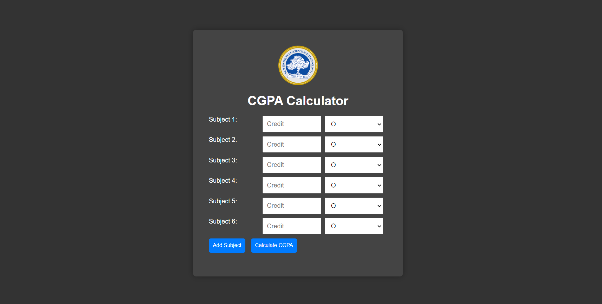

# CGPA Calculator

This is a simple CGPA (Cumulative Grade Point Average) calculator web application. It allows users to input the credits and grades of their subjects to calculate their CGPA.

## Features

- Add multiple subjects dynamically
- Input subject credits and grades
- Calculate CGPA based on the provided inputs
- Responsive design with a dark theme
- University logo displayed at the top and as a favicon

## Technologies Used

- HTML
- CSS
- JavaScript

## Usage

1. Clone the repository:
    ```bash
    git clone https://github.com/yashvt/GPA
    ```

2. Open the `index.html` file in your web browser.

3. Enter the credit and grade for each subject in the provided fields.

4. Click the "Add Subject" button to add more subjects.

5. Click the "Calculate CGPA" button to get the calculated CGPA.

## Files

- `index.html`: The main HTML file containing the structure of the application.
- `styles.css`: The CSS file containing styles for the application.
- `script.js`: The JavaScript file containing the functionality of the application.
- `logo.png`: The logo of the university.

## Screenshot



## Contributing

1. Fork the repository.
2. Create a new branch: `git checkout -b feature-name`.
3. Make your changes and commit them: `git commit -m 'Add some feature'`.
4. Push to the branch: `git push origin feature-name`.
5. Open a pull request.

## License

This project is licensed under the MIT License. See the [LICENSE](LICENSE) file for details.

## Acknowledgements

- This project was inspired by the need to easily calculate CGPA for students.
- Thanks to all the contributors who have helped improve this project.
